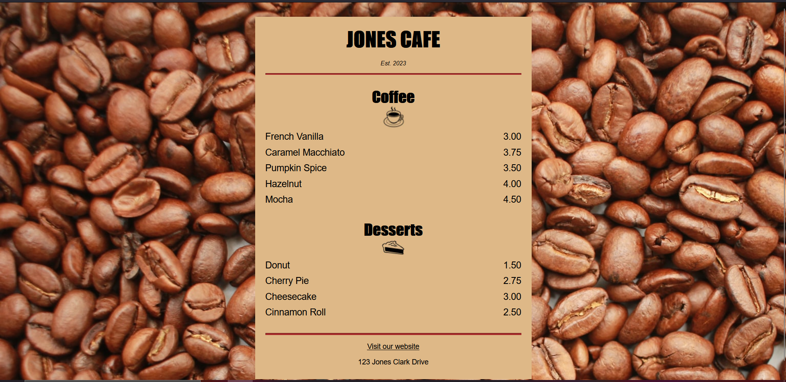
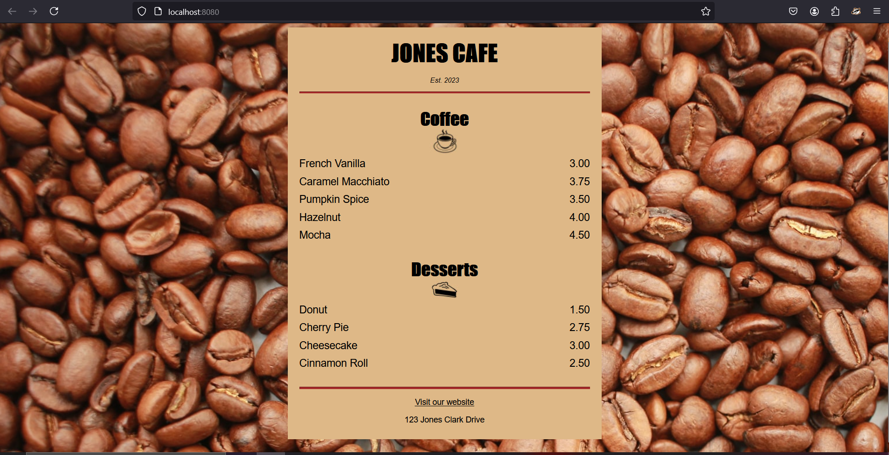
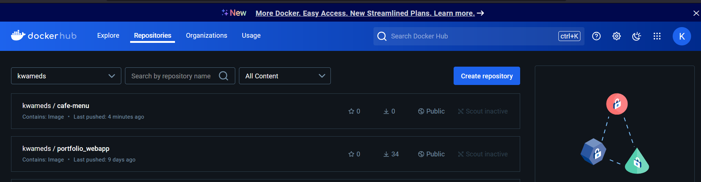
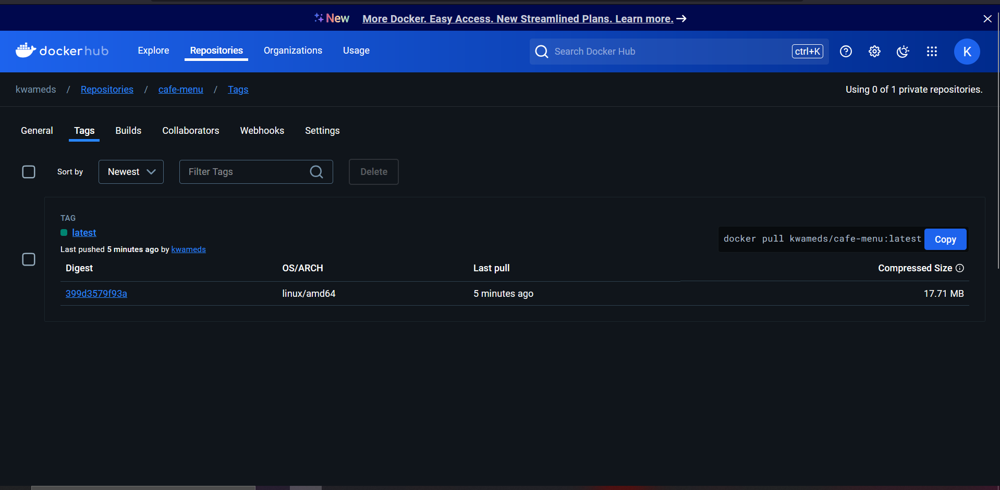
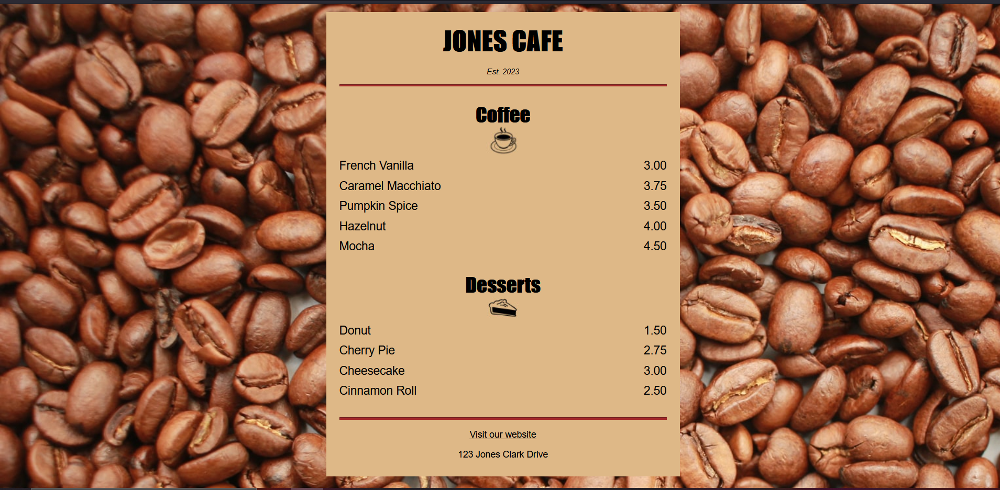

## Jones Cafe Menu - Project Documentation



This document outlines the technical details of the **Jones Cafe Menu** project. The project consists of a simple `HTML` and `CSS` implementation designed to display a coffee shop's menu. The code uses structured HTML to create sections for coffee and desserts, along with their corresponding prices. CSS is applied to style the menu with a focus on *layout, typography, and responsive design*.

### Table of Contents
- [Jones Cafe Menu - Project Documentation](#jones-cafe-menu---project-documentation)
  - [Table of Contents](#table-of-contents)
  - [Project Structure](#project-structure)
  - [HTML Overview](#html-overview)
    - [Key HTML Elements:](#key-html-elements)
  - [CSS Overview](#css-overview)
    - [Key CSS Properties:](#key-css-properties)
  - [Responsive Design](#responsive-design)
- [Deployment](#deployment)
  - [Prerequisites](#prerequisites)
  - [Step 1: Create the Dockerfile](#step-1-create-the-dockerfile)
    - [Dockerfile Breakdown:](#dockerfile-breakdown)
  - [Step 2: Build the Docker Image](#step-2-build-the-docker-image)
  - [Step 3: Verify Image is Built](#step-3-verify-image-is-built)
  - [Step 4: Running the Docker Container](#step-4-running-the-docker-container)
  - [Step 5: Push the Docker Image to DockerHub](#step-5-push-the-docker-image-to-dockerhub)
  - [Step 6: Deploying to Kubernetes](#step-6-deploying-to-kubernetes)
    - [Explanation:](#explanation)
- [](#)
  - [Step 7: Cleanup](#step-7-cleanup)
  - [Summary](#summary)
  - [Attribution](#attribution)
  - [Conclusion:](#conclusion)

---

### Project Structure

The project contains two key files:
- `index.html` — Defines the structure and content of the menu.
- `styles.css` — Defines the visual styling for the menu.

---

### HTML Overview

The `index.html` file is responsible for creating the structure of the **Cafe Menu**. It uses semantic elements such as `<section>`, `<article>`, and `<footer>` to organize the content effectively.

```html
<!DOCTYPE html>
<html lang="en">
  <head>  
    <meta charset="utf-8">
    <title>Cafe Menu</title>
    <link href="styles.css" rel="stylesheet" />
    <meta name="viewport" content="width=device-width, initial-scale=1,0" />
  </head>
  <body>
    <div class="menu">
      <main>
        <h1>JONES CAFE</h1>
        <p class="established">Est. 2023</p>
        <hr>

        <!-- Coffee Section -->
        <section>
          <h2>Coffee</h2>
          
          <article class="item">
            <p class="flavor">French Vanilla</p><p class="price">3.00</p>
          </article>
          <!-- Additional Coffee Items -->
        </section>

        <!-- Desserts Section -->
        <section>
          <h2>Desserts</h2>
          
          <article class="item">
            <p class="dessert">Donut</p><p class="price">1.50</p>
          </article>
          <!-- Additional Dessert Items -->
        </section>
      </main>
      <hr class="bottom-line">
      
      <!-- Footer Section -->
      <footer>
        <p><a href="https://www.freecodecamp.org" target="_blank">Visit our website</a></p>
        <p class="address">123 Jones Clark Drive</p>
      </footer>
    </div>
  </body>
</html>
```

#### Key HTML Elements:
- **`<main>`**: Contains the core content of the page.
- **`<section>`**: Used to group coffee and dessert items.
- **`<article>`**: Represents individual menu items (both coffee and desserts).
- **`<footer>`**: Contains the website link and the address of the cafe.
- **``**: Adds images for coffee and dessert sections.

---

### CSS Overview

The `styles.css` file defines the visual layout and style of the menu. It focuses on typography, layout, and ensuring a visually appealing presentation of the menu items.

```css
/* Global Styling */
body {
   background-color: burlywood;
   background-image: url(https://cdn.freecodecamp.org/curriculum/css-cafe/beans.jpg);
   font-family: sans-serif;
   padding: 20px;
}

h1, h2, p {
    text-align: center;
}

.menu {
    width: 80%;
    max-width: 500px;
    background-color: burlywood;
    margin: 0 auto;
    padding: 20px;
}

img {
    display: block;
    margin: -25px auto 0;
}

.item p {
    display: inline-block;
    font-size: 18px;
}

/* Footer Styling */
footer {
    font-size: 14px;
}

a:hover {
    color: brown;
}
```

#### Key CSS Properties:
- **`body`**: Sets the background color and background image. The padding adds spacing around the content.
- **`.menu`**: Centers the content on the page and defines the max width to ensure responsiveness.
- **`h1, h2, p`**: Aligns the text to the center for headers and paragraphs.
- **`img`**: Centers the images and adjusts the margins for proper spacing.
- **`.item p`**: Uses `inline-block` to align the price with the flavor/dessert name.
- **`footer`**: Customizes the footer size and link interactions.

---

### Responsive Design

The menu is designed to be responsive, adapting to various screen sizes:
- The `<meta name="viewport" content="width=device-width, initial-scale=1.0" />` tag ensures the menu scales properly on different devices.
- The **`.menu`** class has a `max-width` of 500px, making it fit well on both desktop and mobile displays.
- The layout remains simple with images, text, and spacing adjusted for readability on smaller screens.

---
Sure! Below is a **Deployment Section** that explains how to containerize the Cafe Menu project using Docker, push the image to my DockerHub repo, and deploy it using both Docker and Kubernetes. This includes a detailed `Dockerfile`, instructions on pushing the image, and deploying it for web access.

---

## Deployment

This section details the steps to containerize the **Camper Cafe Menu** project, push the image to DockerHub, and deploy it using Docker and Kubernetes.

### Prerequisites
Before we begin, ensure you have the following installed:
- [Docker](https://docs.docker.com/get-docker/)
- [Kubernetes CLI (`kubectl`)](https://kubernetes.io/docs/tasks/tools/install-kubectl/)
- A DockerHub account (username: `kwameds`)

---

### Step 1: Create the Dockerfile

Create a `Dockerfile` in my project root directory with the following content:

```Dockerfile
# Dockerfile for Camper Cafe Menu
# Maintainer: Jones

# Step 1: Use an official lightweight Node.js image as the base image
FROM nginx:alpine

# Step 2: Set the working directory inside the container
WORKDIR /usr/share/nginx/html

# Step 3: Copy the HTML and CSS files into the container
COPY index.html .
COPY styles.css .

# Expose port 80 to access the container on the web
EXPOSE 80

# Step 4: Use Nginx to serve the static files
CMD ["nginx", "-g", "daemon off;"]
```

#### Dockerfile Breakdown:
- **Base Image**: We're using the lightweight `nginx:alpine` image to serve the static HTML and CSS files.
- **Working Directory**: We set the working directory inside the container to `/usr/share/nginx/html` (the default directory for serving static files in Nginx).
- **Copy Files**: We copy the HTML and CSS files into the Nginx folder for serving.
- **Expose Port 80**: The container exposes port 80, so the application will be accessible via this port.
- **CMD**: The default command runs Nginx to serve the files.

---

### Step 2: Build the Docker Image

In the project root, where the `Dockerfile` is located, I will run the following command to build the Docker image:

```bash
docker build -t kwameds/cafe-menu:latest .
```

This command:
- Builds the image from the `Dockerfile`.
- Tags it as `kwameds/cafe-menu:latest`, which refers to my DockerHub repo `kwameds` with the image name `cafe-menu`.

---

### Step 3: Verify Image is Built
I can verify if the image is built by:
1. **Listing Images**: Docker images can be listed by running:
```bash
docker image ls
```

> Output: 
>
```
REPOSITORY                         TAG       IMAGE ID       CREATED         SIZE
kwameds/cafe-menu                  latest    f24d22639983   4 minutes ago   66.2MB
```
---

### Step 4: Running the Docker Container

Next, I will now run the Docker container locally to verify that everything is working as expected.


```bash
docker run -d -p 8080:80 kwameds/cafe-menu:latest
```

This command:
- Runs the container in detached mode (`-d`).
- Maps port `8080` on my local(host) machine to port `80` in the container (`-p 8080:80`).

I can now access the Cafe Menu by visiting `http://localhost:8080` in my browser.<p>
<p>

---
### Step 5: Push the Docker Image to DockerHub
Having confirmed the imaged was built successfully, I will push it to my Dockerhub repository.
1. Log in to my DockerHub account via the command line:

```bash
docker login -u <reponame>
```

After logging in, push the Docker image to my DockerHub repository:

```bash
docker push kwameds/cafe-menu:latest
```

This will upload the image to DockerHub, making it publicly accessible in my repo.

<p>
<p>

---

### Step 6: Deploying to Kubernetes

1. **Create a Kubernetes Deployment YAML**:
   
   I need to create a file called `deployment.yaml` with the following content:<p>

   ```yaml
   apiVersion: apps/v1
   kind: Deployment
   metadata:
     name: cafe-menu-deployment
   spec:
     replicas: 1
     selector:
       matchLabels:
         app: cafe-menu
     template:
       metadata:
         labels:
           app: cafe-menu
       spec:
         containers:
         - name: cafe-menu
           image: kwameds/cafe-menu:latest
           ports:
           - containerPort: 80

   ---
   apiVersion: v1
   kind: Service
   metadata:
     name: cafe-menu-service
   spec:
     type: LoadBalancer
     ports:
     - port: 80
       targetPort: 80
     selector:
       app: cafe-menu
   ```

   #### Explanation:
   - **Deployment**: Creates a deployment that runs 1 replica of the Docker container from the image `kwameds/cafe-menu:latest`.
   - **Service**: Exposes the deployment as a service of type `LoadBalancer` that listens on port 80.

2. **Deploy the Application**:
   
   Apply the Kubernetes configuration using the following command:

   ```bash
   kubectl apply -f deployment.yaml
   ```
    > Output:
    ```bash
    deployment.apps/cafe-menu-deployment created
    service/cafe-menu-service created
    ```

3. **Access the Application**:
   
   Get the deployment and running application (pod):
   ```bash
   kubectl get deploy
   ```
   > Output:
   ```
   NAME                   READY   UP-TO-DATE   AVAILABLE   AGE
   cafe-menu-deployment   1/1     1            1           8m22s
   ```

   ```
   kubectl get pods 
   ```
   > Output:
   ```
   NAME                                    READY   STATUS    RESTARTS   AGE
   cafe-menu-deployment-546d8b69f6-k489p   1/1     Running   0          10m
   ```
   Access application on the browser:
   ```bash
   kubectl get svc cafe-menu-service
   ```
   > Output:
   ```
   NAME                TYPE           CLUSTER-IP       EXTERNAL-IP   PORT(S)        AGE
   cafe-menu-service   LoadBalancer   10.111.179.176   localhost     80:32171/TCP   11m
   ```
   Once the external IP is ready, I can access the Cafe Menu via `http://<EXTERNAL-IP>`. In my case, I will access the Cafe Menu app via `http://localhost:80`.<p>

   <p>
---

### Step 7: Cleanup

If you want to stop the container or remove the Kubernetes deployment, follow these steps:

1. **For Docker**:
   - Views containers running:
     ```
     docker container ls
     ```
     > Output:
     ```
     CONTAINER ID   IMAGE                       COMMAND                  CREATED             STATUS             PORTS                  NAMES
     775e1d60b528   kwameds/cafe-menu:latest    "/docker-entrypoint.…"   About an hour ago   Up About an hour   0.0.0.0:8080->80/tcp   flamboyant_nobel
     ```

   - Stop and remove the container:
     ```bash
     docker rm -f <container-id>
     ```

2. **For Kubernetes**:
   - Delete the deployment and service:
     ```bash
     kubectl delete -f deployment.yaml
     ```

---

### Summary

In this section, we covered:
- How to create a `Dockerfile` and build a Docker image for the Cafe Menu project.
- How to push the Docker image to DockerHub.
- How to run the project using Docker locally and Kubernetes in a cloud environment.

---
### Attribution

Images used in the project are sourced from [freeCodeCamp's Curriculum](https://www.freecodecamp.org/curriculum):
- Coffee Image: `https://cdn.freecodecamp.org/curriculum/css-cafe/coffee.jpg`
- Pie Image: `https://cdn.freecodecamp.org/curriculum/css-cafe/pie.jpg`
- Background Image: `https://cdn.freecodecamp.org/curriculum/css-cafe/beans.jpg`

---
### Conclusion:
This documentation provides an overview of the building and application from scratch with the code and its functionality, helping to understand the structure and styling used in the Cafe Menu project. Also, discusses how to build the containerise the application with docker and deploy it with either Docker or Kubernetes. 